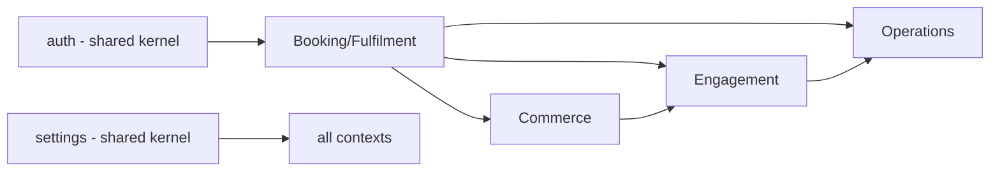

# BOUNDED_CONTEXTS

Bounded contexts group domains that share a ubiquitous language and a transactional boundary.
Relationships use standard DDD patterns.

## Contexts
| Context | Domains | Relationship to others |
|---|---|---|
| **Booking & Fulfilment** | booking, dispatch, trips, vehicles, drivers | Core; emits events consumed by payments/notifications/analytics |
| **Commerce** | payments, customers, hotels | Consumes booking events; emits payment events |
| **Engagement** | notifications, chat, ai, ratings, moderation | Consumes domain events; talks to WhatsApp/LLM |
| **Operations** | cases, settings, analytics | Read-mostly; settings is a shared kernel |
| **Identity** | auth (users/roles/permissions) | Shared kernel consumed by every context |
| **Geo** | maps | Stateless helper for dispatch/booking |

## Relationships
- **Shared Kernel:** `auth` (identity/RBAC) and `settings` are used by all contexts; they are
  the only "shared" mutable contexts and are kept minimal and stable.
- **Customer/Supplier:** booking (supplier of `booking.created`) → payments/notifications
  (customers). Events are the contract; no direct calls.
- **Anti-Corruption Layer (ACL):** `packages/api` is the ACL between applications and domains —
  apps never see domain internals. `packages/realtime` is the ACL for async events.
- **Separate Ways:** `maps` and `moderation` are stateless utilities with no shared state;
  they participate only by being called, not by owning data.

## Rule
A context may **not** reach into another context's database. Cross-context needs are met via
the event catalog (`EVENT_OWNERSHIP.md`) or read models in `analytics`.
