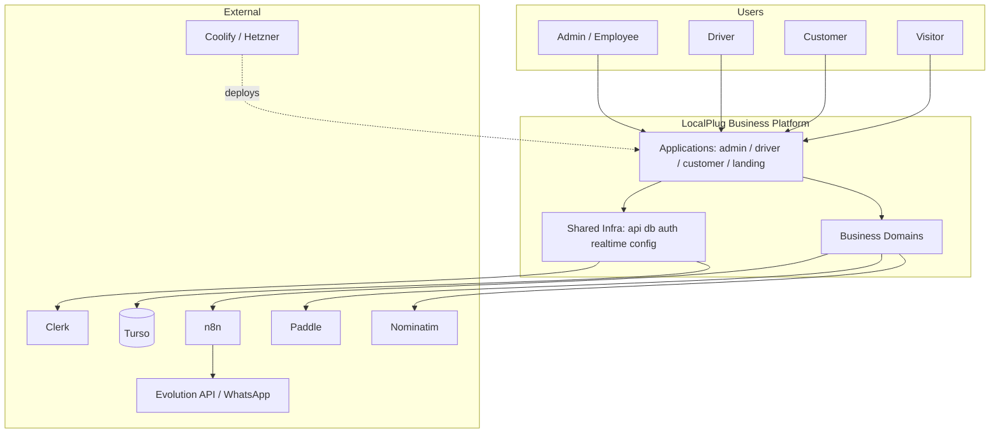

# CONTEXT_DIAGRAM

The platform in its environment: who/what interacts with it.

## Context notes
- **Identity** is always Clerk; OTP via WhatsApp (Evolution) is a branded second factor.
- **WhatsApp** is inbound/outbound through n8n + Evolution; it is a *notification* and *chat*
  channel, not a domain itself.
- **Payments** go through Paddle; payouts to drivers are computed by the payments domain.
- **Maps/geocoding** use Nominatim; stateless, owned by the maps domain.
- **Deployment** is Coolify on Hetzner; the realtime server is a persistent container.
