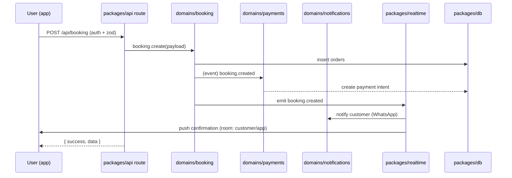

# INTERACTION_DIAGRAM

How modules interact at runtime for a representative write flow (booking creation). Read
flows and other domains follow the same shape: **app → api (orchestrate) → domain → db /
realtime / notifications**.

## Key interactions
- **App → API:** thin orchestration (auth, validation, envelope).
- **API → Domain:** the only place an app touches a domain.
- **Domain → DB:** direct, owned tables only.
- **Domain → Realtime:** publish event (no logic in realtime).
- **Realtime → Notifications / Apps:** broadcast; notifications may trigger WhatsApp via n8n.
- **Domain → Domain:** never direct; always via event (dashed path above).

See `SEQUENCE_DIAGRAMS.md` for full workflows and `EVENT_OWNERSHIP.md` for the catalog.
