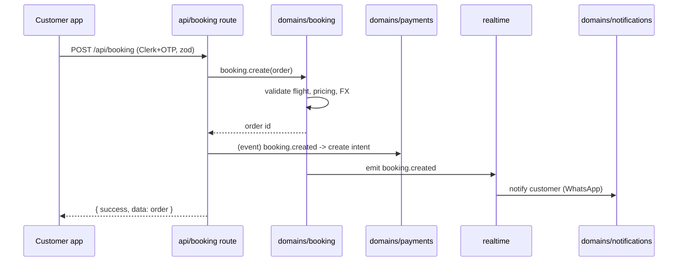
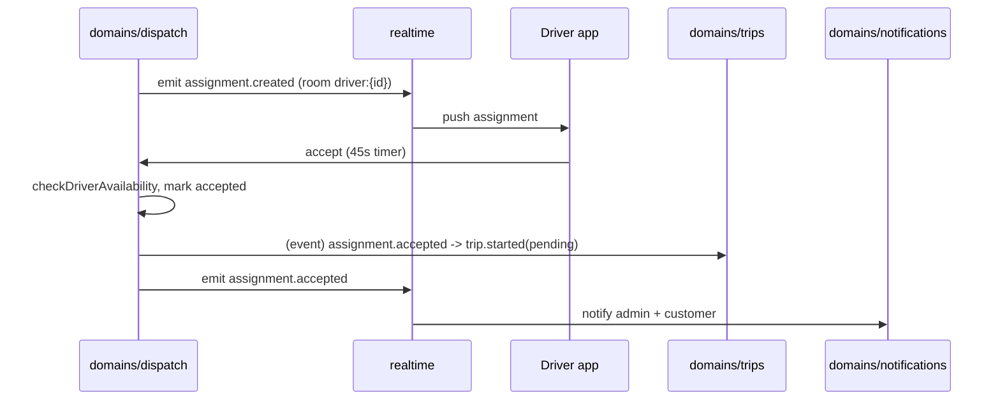
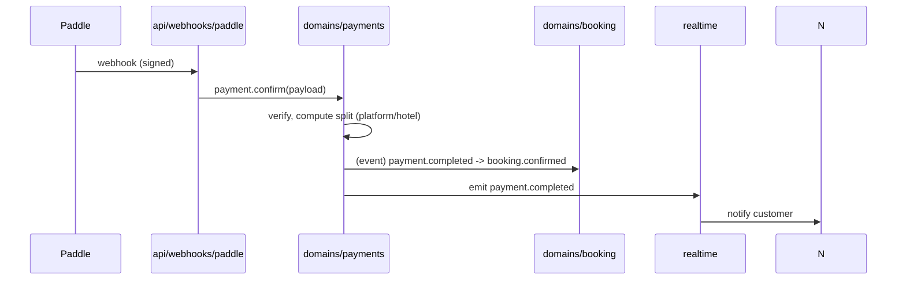
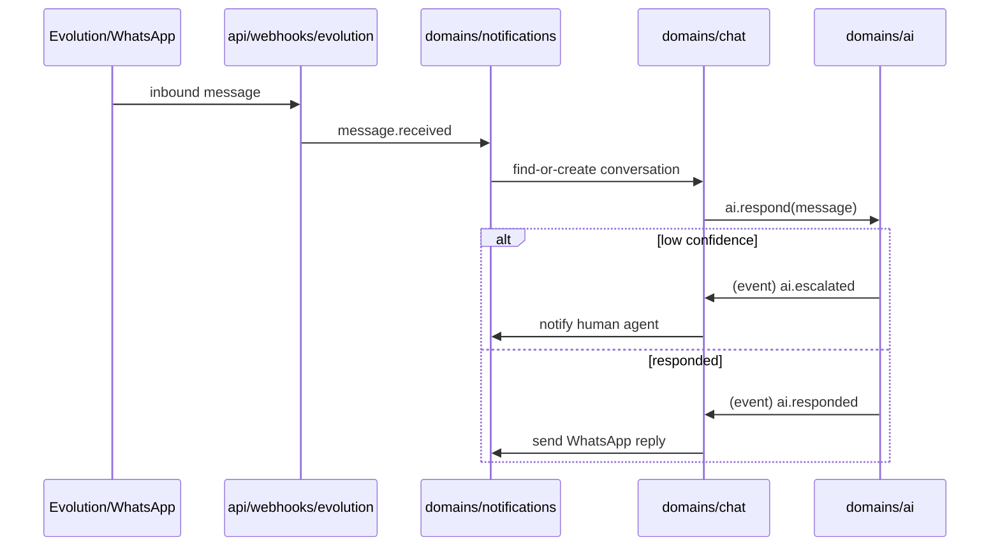
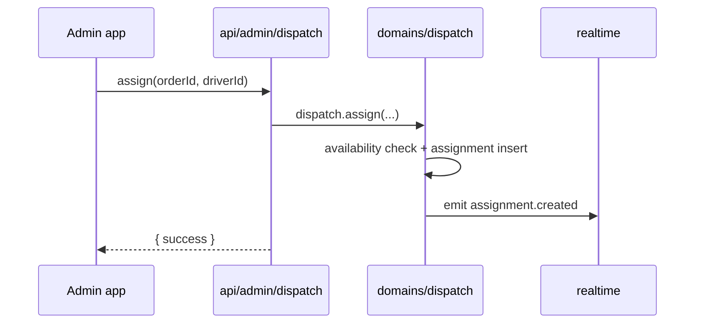

# SEQUENCE_DIAGRAMS

Sequence diagrams for the major workflows, in the target architecture. They show the
**approved** interaction shape (app → api → domain → db/realtime). Compare with the current
embedded-logic routes in `../../99-analysis/PLATFORM_DISCOVERY.md`.

## 1. Booking creation (customer/app)

## 2. Driver assignment accept (dispatch)

## 3. Payment confirmation (Paddle webhook)

> Note: today the split calc + order confirm is duplicated in `app/api/booking/route.ts` and
> `app/api/webhooks/paddle/route.ts` (TECH_DEBT H-3). Target: single owner = payments.

## 4. WhatsApp inbound → AI → escalation (chat/ai/notifications)

> Note: the god-route `app/api/webhooks/n8n/route.ts` is **replaced** by this dispatcher
> (TECH_DEBT H-4).

## 5. Admin dispatch (current → target)
Current: `app/api/admin/dispatch/route.ts` (289 lines) does SQL + state machine + n8n inline.
Target:

